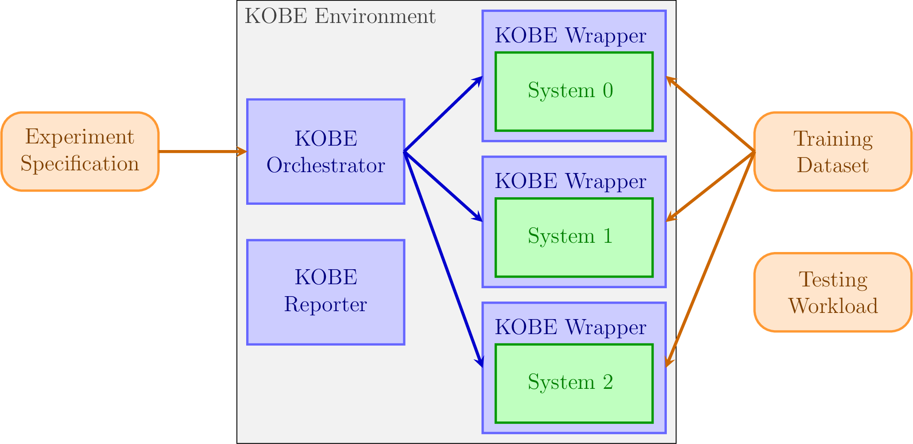
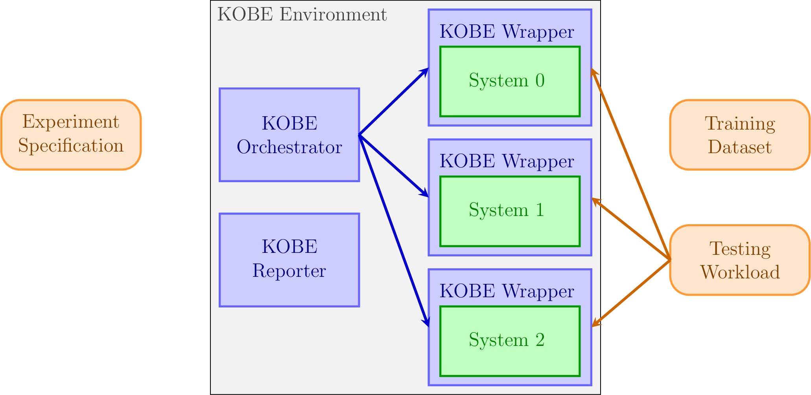
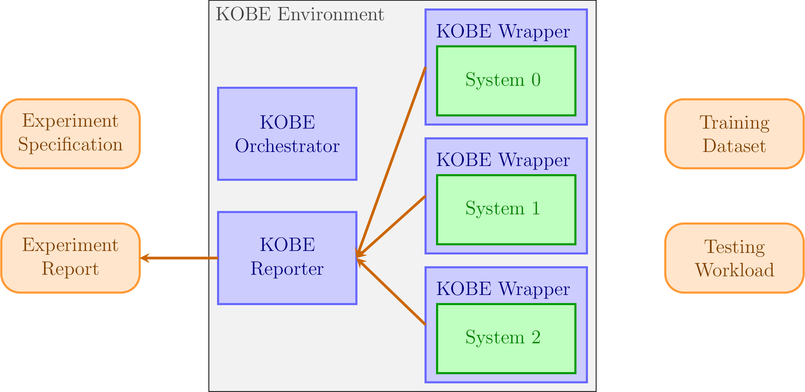
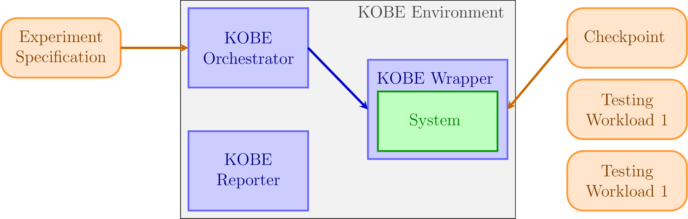
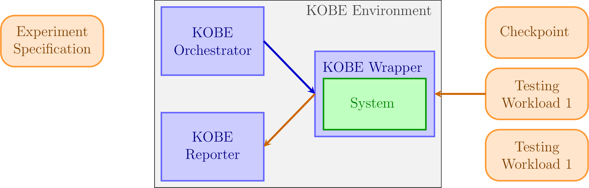
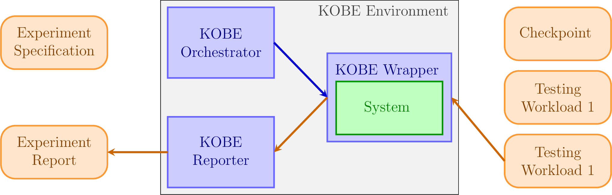
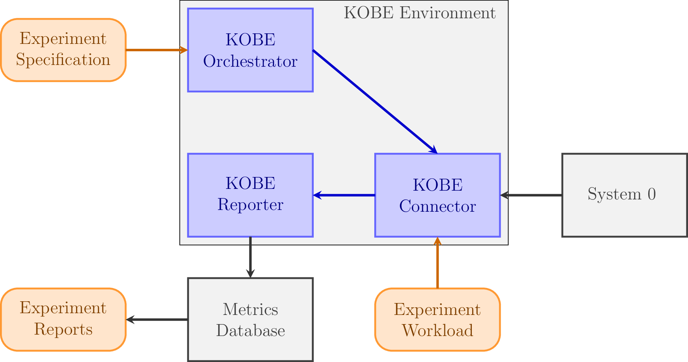
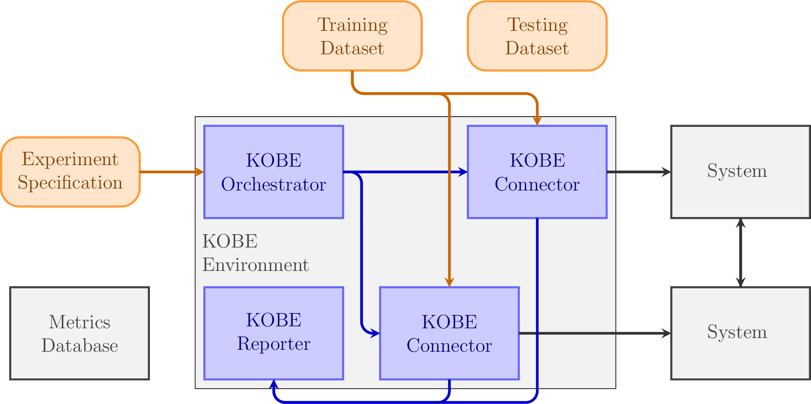
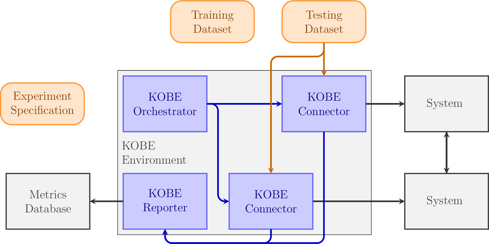

# Information Flow

This section specifies the interactions between KOBE and the systems
that are being benchmarked. Three different experimental setups are
presented:

* In the _stand-alone setup_, the complete experiment executes within a single process and all communication takes place via direct parameter passing and shared filesystem access.

* In the _distributed setup_ KOBE benchmarks remote systems that are only accessible over a Web API.

* In the _k8s setup_ both KOBE and the benchmarked systems execute on K8s pods in the same cluster. This setup is typically used to simulate the distributed setup in a reproducible manner.

## Stand-alone Setup

The experimental setup includes:

* The KOBE installation.

* The experiment specification YAML file.

* The benchmarked systems, as Python packages. The user must ensure that these have been installed in the same environment as KOBE and can be imported.

* The KOBE Wrappers to these systems. These abstract away from the specifics of each system to present to KOBE a unified API. Wrappers for well-known, established frameworks are provided as part of the KOBE system. The user must ensure that Wrappers for all benchmarked systems have been installed in the same environment as KOBE and can be imported.

* The data needed to execute the experiment.

### Training and testing

In this example, the user is comparing three different ML systems on the same dataset.

* The user executes the `kobectl` executable passing to it the experiment specification YAML file. This executable first invokes the KOBE Orchestrator module to carry out the experiment.

* The KOBE Orchestrator ensures that the data foreseen in the specification is available on the local filesystem. If the specification gives remote data locations, the Orchestrator downloads the files locally.

* The KOBE Orchestrator dynamically imports the KOBE Wrappers foreseen in the specification. The actual ML systems are imported as dependencies of their respective wrappers.

* The KOBE Orchestrator uses the Wrapper API to train the systems. The Orchestrator communicates to the Wrappers the locations of the training data. KOBE Wrappers are responsible for any pre-processing necessary to format the data as is appropriate for the system they wrap. The Wrappers that are provided as part of the KOBE system have a specification for the data format they are able to read. If the data does not follow the specification, the user must either pre-process the data or extend the Wrapper.

|  |
|:--:|
| *Information flow during training* |

* The experiment specification also includes the benchmarking metrics that should be collected. This is communicated to the Wrappers by Orchestrator. The Wrappers evaluate the training-time metrics (e.g., computation time, loss) in the course of their interaction with their respective ML systems and write out CSV files with per-system metrics. The user must extend the Wrapper for non-standard metrics.

* Experiments might be multi-step pipelines. In our example, we have a training step and a testing step. At the end of the training step, the Orchestrator uses (different methods of) the Wrapper API again to execute the testing workload.

|  |
|:--:|
| *Information flow during testing* |

* At the end of all steps, the KOBE Reporter collects, collates, and processes the benchmarking measurements from all systems and steps to prepare a unified report for the complete experiment.

|  |
|:--:|
| *Information flow during report preparation* |

### Testing pre-trained models

In this example, the user is comparing a pre-trained ML system on two
different testing workloads.

* The user executes the `kobectl` executable passing to it the experiment specification YAML file. Same as before, the KOBE Orchestrator ensures that the data (pre-trained checkpoints and testing workloads) is available on the local filesystem and imports the KOBE Wrapper of the ML system.

* The KOBE Orchestrator uses the Wrapper API to load the chechpoint. The Wrapper is responsible for checking the compatibility between the checkpoint and the ML system and issuing an error if they are not compatible.

|  |
|:--:|
| *Information flow during data loading* |

* The Orchestrator uses the Wrapper API to execute the testing workload and collect benchmark metrics. In contrast to the previous example, since different sets of metrics need to be collected from the same system the reporter must collect the metrics after each run.

|  |
|:--:|
| *Information flow during testing* |

* The Orchestrator uses the Wrapper API a second time to execute the second testing workload. At the end of all runs, the KOBE Reporter collates and processes the benchmarking measurements from all runs to prepare a unified report for the complete experiment.

|  |
|:--:|
| *Information flow during final testing run and report preparation* |

## Distributed Setup

The experimental setup includes:

* The KOBE installation.

* The experiment specification YAML file.

* The benchmarked systems, provisioned independently of KOBE. These can be Docker containters or completely remote systems or any other instance of a system that can be accessed via a Web API.

* The KOBE Connectors. These abstract away from the specifics of each system's API to present to KOBE a unified API.The user must ensure that Wrappers for all benchmarked systems have been installed in the same environment as KOBE and can be imported.

* The workload (testing data) that will be executed.

* Optionally, a remote metrics database. The KOBE Reporter produces files that collate all metrics collected from a single experiment. To facilitate more complex workflows (such as populating model stores with benchmarking results, comparing across experiments, or complex visualizations) KOBE also features the capability to populate an external database with the benchmarking results.

### Testing provisioned, pre-trained systems

In this example, the user benchmarks a pre-trained, external ML system and stores the results in an external database.

* The user executes the `kobectl` executable passing to it the experiment specification YAML file. The KOBE Orchestrator ensures that the testing workload is available on the local filesystem and imports the KOBE Connector for the remote ML system.

* The Orchestrator uses the Connector API to direct the connect to load the workload and execute the experiment.

* The Connector is responsible to making the measurements needed to evaluate the benchmarking metrics. Naturally, the benchmarking metrics are restricted to what what be measured on the client side of the system. Metrics such as, i.e., power consumption are inaccessible unless the system provides them through the Web API.

* In case of experiments involving multiple systems and/or workloads, all metrics are collated by ther Reporter similarly to the previous examples.

* The collated metrics are either returned to the user or stored to a remote metrics database.

|  |
|:--:|
| *Information flow when benchmarking remote systems* |

### Testing distributed systems

In this example, the user trains and tests a distributed learning
method. For this example, the user needs to externally provision
multiple instances of the method implementation. By contrast to
previous examples, in this example multiple system instances are
involved in _one_ experiment. Therefore, to compare different
distributed systems the user needs to set up multiple experiments such
as the one described here.

* The user executes the `kobectl` executable passing to it the experiment specification YAML file. The KOBE Orchestrator instantiates multiple instances of the same KOBE Connector.

* The KOBE Orchestrator uses the KOBE Connector API to train the distributed system and KOBE Reporter collects the training benchmarking metrics.

|  |
|:--:|
| *Information flow during training* |

* The KOBE Orchestrator uses the KOBE Connector API to execute the testing workload and KOBE Reporter collects the testing benchmarking metrics.

* At the end of all steps, the KOBE Reporter collates and processes the benchmarking measurements from all steps to prepare a unified report for the complete experiment.

|  |
|:--:|
| *Information flow during testing and report preparation* |

Naturally, an experiment such as this can also be executed in the Stand-alone Setup, but the communication overhead will be unrealistically small.
